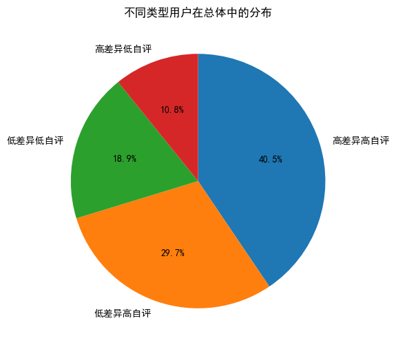
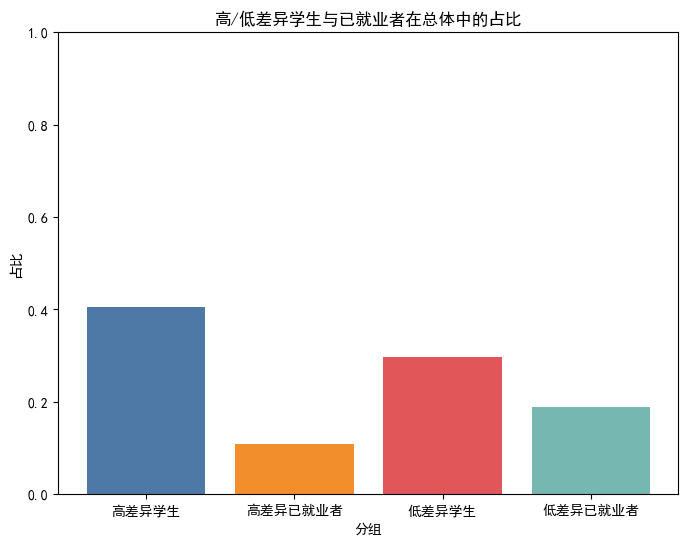
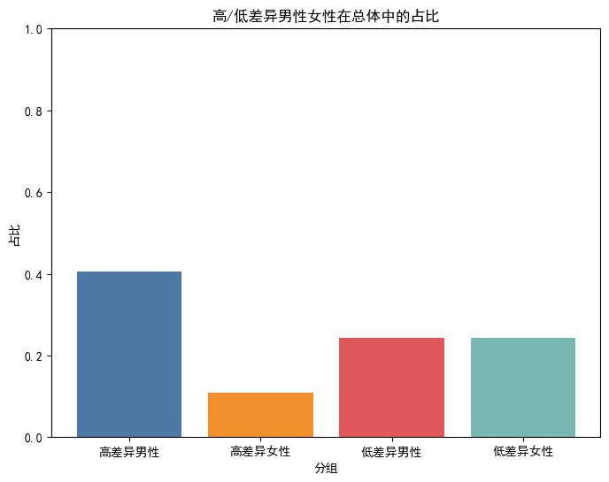

# AI虚拟形象下的外貌偏见的量化研究

**项目目标**

探究在信息匮乏的初次接触中，视觉符号（着装、发型）如何量化影响人类对“能力感”与“亲和力”的直觉判断。

---

## 1. 项目背景

有一天和朋友聊天的时候，我的朋友突然毫不避讳地提到自己是会以貌取人的。引起了我的思考，其实当代社会上以貌取人的情况非常多，这与我们从小被教育的“不要以貌取人”相悖。当天我又问了几个亲朋好友，有相当一部分人认为自己会以貌取人。

我感觉这个现象十分有趣，尤其是在流量时代媒体宣传的作用下（如面相论、容貌焦虑的贩卖），我们现在已经很少提到“不要以貌取人”这一高尚品德。于是我决定对这一现象进行量化研究：

- 在职场招聘和日常社交中，人们常声称“不以貌取人”，但潜意识中的偏见往往难以察觉？
- 还是人们现在已经认为以貌取人是稀松平常的？

---

## 2. 数据字典与实验设计

- 本项目使用4张标准化的AI生成形象作为控制变量，避免了真人照片中无关噪音（如品牌、复杂背景）的干扰。
- 数据集说明：
  - 样本量：37份原始数据（包含年龄、性别、专业等维度）。
  - 字段涵盖：能力感打分、亲和力打分、社会地位感预测、起薪预判等。

---

## 3. 分析脉络

1. **数据清洗**
	- 答题时间过短的问卷已通过腾讯问卷平台删除。
	- 删掉那些给四张图打分全部一模一样的人。

2. **特征工程**
	- 研究各个背景下的受访者打分特征分组聚合。
	- 研究所有受访者主客观打分偏差。

## 4. 局部手术与核心发现
1.相当一部分人(40.5%)十分坦诚，坦然承认在资源有限时会优先选择外貌较好的那一类，且此类人占比最高。
2.存在显著的“过度自省”群体(29.7%)，他们可能在刻意对抗偏见，察觉到自己有偏见（主观上认为自己有以貌取人但客观上打分公正）。
3.理性中立者 (18.9%)：言行一致，客观冷静，选择几乎不受AI形象干扰。
4.还有一小部分群体(10.8%)在对不同外貌群体的打分差异较大的情况下，对于自己的以貌取人持否认态度，这部分人主观上认同“不应以貌取人”的道德准则，并真诚地认为自己做到了，实际上并非如此。

另外
1.数据中“高差异学生”的占比明显高于“高差异已就业者”。这可能反映出校园环境向职场环境过渡时的“认知简化”。

2.女性受访者高差异打分比例低于男性，可能女性在评价他人时具备更强的综合评估逻辑与自我修正意识

而且
通过进一步调查大家认为最重要的品质，发现大家给外貌选项排名并不高且在前面客观评分高差异与低差异的人在此处差异不大甚至在 Q20 里把外貌排在前面的“重视组”，实际打分的总方差（3.03）居然比“不重视组”（3.11）还低！外貌偏见并非不可抗拒的本能，一旦偏见被个体显性化承认，理性的介入便能有效对冲视觉偏见。

本研究通过 AI 模拟生成的职场形象发现：“颜值即正义”不再是潜意识秘密，而是一种被广泛觉察的社会共识。虽然仅有 10% 的人完全未觉察到自己的偏见，但高达 30% 的受访者通过高度的自我觉察，在实际行动中成功对冲了视觉符号带来的干扰。
